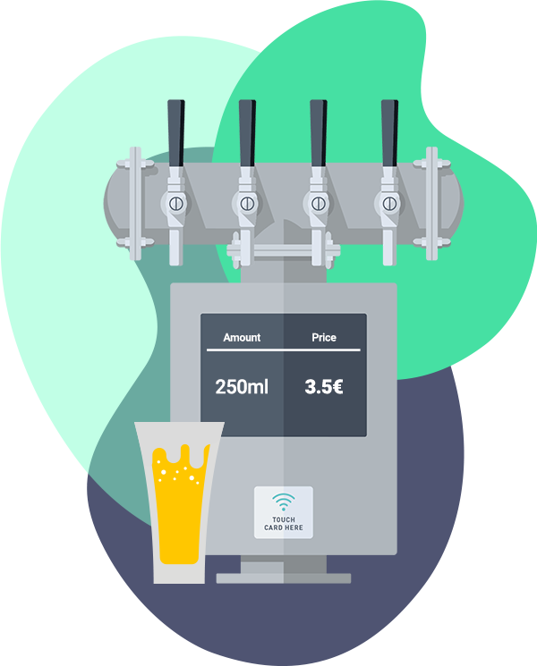

# Beer tap dispenser API

Anyone who goes to a festival at least one time knows how difficult is to grab some drinks from the bars. They are
crowded and sometimes queues are longer than the main artist we want to listen!

That's why some promoters are developing an MVP for new festivals. Bar counters where you can go and serve yourself
a beer. This will help make the waiting time much faster, making festival attendees happier and concerts even more
crowded, avoiding delays!

    

## How it works?

The aim of this API is to allow organizers to set up these bar counters allowing the attendees self-serving.

So, once an attendee wants to drink a beer they just need to open the tap! The API will start counting how much flow
comes out and, depending on the price, calculate the total amount of money.

You could find the whole description of the API in the [OpenAPI description file](/api.spec.yaml) and send request to a
mock server with [this URL](https://rviewer.stoplight.io/docs/beer-tap-dispenser/juus8uwnzzal5-beer-tap-dispenser)

### Workflow

The workflow of this API is as follows:

1. Admins will **create the dispenser** by specifying a `flow_volume`. This config will help to know how many liters of
   beer come out per second and be able to calculate the total spend.
2. Every time an attendee **opens the tap** of a dispenser to puts some beer, the API will receive a change on the
   corresponding dispenser to update the status to `open`. With this change, the API will start counting how much time
   the tap is open and be able to calculate the total price later
3. Once the attendee **closes the tap** of a dispenser, as the glass is full of beer, the API receives a change on the
   corresponding dispenser to update the status to `close`. At this moment, the API will stop counting and mark it
   closed.

At the end of the event, the promoters will want to know how much money they make with this new approach. So, we have to
provide some information about how many times a dispenser was used, for how long, and how much money was made with each
service.

> ⚠️ The promoters could check how much money was spent on each dispenser while an attendee is taking beer!
> So you have to control that by calculating the time diff between the tap opening and the request time

---

## What are we looking for?

* **A well-designed solution and architecture.** Avoid duplication, extract re-usable code
  where makes sense. We want to see that you can create an easy-to-maintain codebase.
* **Test as much as you can.** One of the main pain points of maintaining other's code
  comes when it does not have tests. So try to create tests covering, at least, the main classes.
* **Document your decisions**. Try to explain your decisions, as well as any other technical requirement (how to run the
  API, external dependencies, etc ...)

## How to submit your solution

* Push your code to the `devel` branch - we encourage you to commit regularly to show your thinking process was.
* **Create a new Pull Request** to `main` branch & **merge it**.

Once merged you **won't be able to change or add** anything to your solution, so double-check that everything is as
you expected!

Remember that **there is no countdown**, so take your time and implement a solution that you are proud!

--- 

  If you have any feedback or problem, <a href="mailto:help@rviewer.io">let us know!</a> 🤘
    
  Made with ❤️ by <a href="https://rviewer.io">Rviewer</a>

